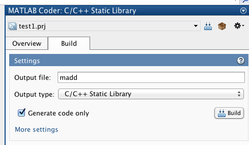
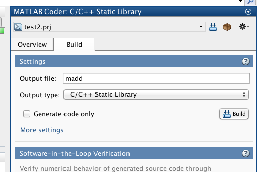

#Learn Matlab Code Generation
##matlabCodeGeneration
使用`Matlab`的`APPS`－`MATLAB Coder`  
勾选`Generate Code only`  
点击`build`生成代码  
  
接着自己构建起工程，生成`lib`文件
继续生成工程测试这个lib文件  
######ps: 注意cpp文件调用c函数库的时候，需要声明为`extern "C"`，或者干脆就用c文件调用c文件吧

##matlabCodeGeneration1
使用`Matlab`的`APPS`－`MATLAB Coder`  
**不**勾选`Generate Code only`  
点击`build`生成代码  
  
接着自己构建起测试工程，使用`CMake`将Matlab生成的静态库包含进去  

######ps：CMake的FIND_LIBRARY需要静态库以`lib`开头，可是matlab生成的库确没有这个前缀，所以需要手动修改一下，例如原来是madd.a，需要修改为libmadd.a  
